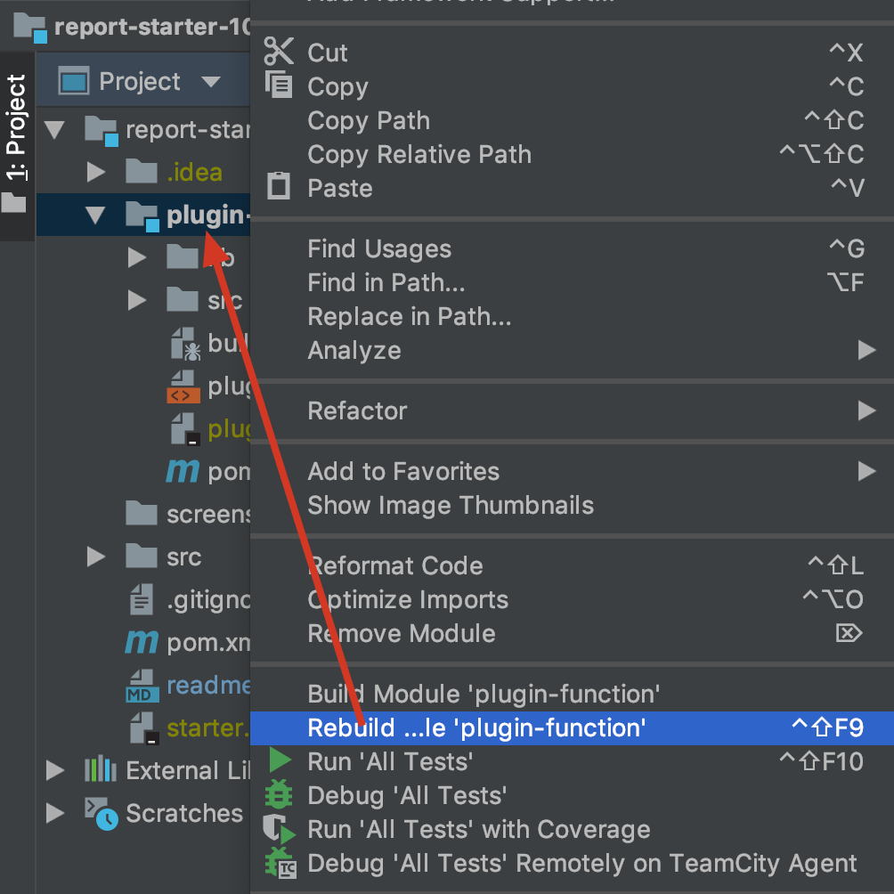

# 工程配置指南

完全傻瓜化的配置，开箱即用。

## 安装gradle
用于构建开发工程和插件包，gradle安装文档参考：https://wiki.jikexueyuan.com/project/gradle-2-user-guide/installing.html

## 配置开发工程
直接使用IntelliJ IDEA打开这个目录即可。

如果需要复制jar包到webroot/WEB-INF/lib下，可以执行命令：```gradle install```

**注意：**该工程依赖的jar为私有maven服务器，地址在build.gradle的repositories中定义。

## 启动应用程序

### 复制插件配置

* 将plugin.xml文件复制到webroot/WEB-INF/plugins/plugin-xyz-1.0目录下，其中xyz一般用插件id表示。
* 在开发工具内部，手动编译插件class文件到插件目录


### 启动设计器
如果希望正常的进行插件开发，使用```com.fr.learn.Learner```启动设计器。

如果希望进行设计器调试，则使用```com.fr.learn.Learner4Debug```启动设计器。

### 选择报表运行环境
一般情况启动设计器的时候，会自动使用上一次使用的报表运行环境，我们这里需要新建一个本地报表运行环境，并指向这个开发目录下的webroot/WEB-INF目录。

## 构建插件包
执行命令：```gradle zip```即可构建插件包，插件包位置位于插件目录/build/install下。

## 增加新的插件
将插件源码目录放到根目录下，同时修改settings.gradle文件，再刷新gradle配置即可。

## 修改依赖的jar版本
只需要更改build.gradle中的fineVersion变量即可。

|fineVersion|含义|
|--------------|----|
|10.0-RELEASE-SNAPSHOT|10.0的测试版本快照|
|10.0-SNAPSHOT|10.0的正式版本快照|
|10.0|10.0的正式版本|